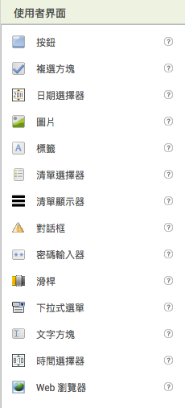
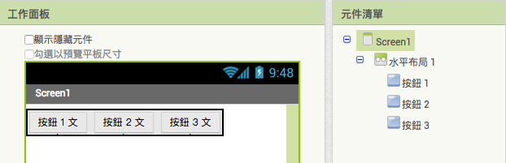
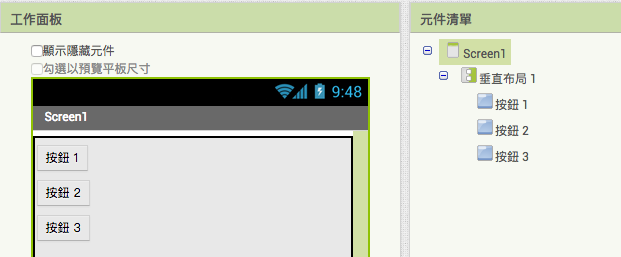

# 基礎

### 使用者介面

### 佈局

**水平佈局**

**垂直佈局**

### 模擬器

* 開啟 aiStart
* 點擊上方選單的「連線」- 「模擬器」

### 方塊

#### 控制流程

if...else if...else

#### 邏輯運算

* 等於
* 並且
* 或許
* true 和 false
* 相反

#### 算術運作

* 加
* 減
* 乘
* 除

#### 文字

* 空字串
* 合併文字

#### 清單

#### 顏色

#### 變數

* 初始化變數
* 設定變數
* 取得變數值

#### 程序

* 無回傳值程序
* 有回傳值程序

### 延伸閱讀

* [TQC - 創意App程式設計 (App Inventor)](http://www.tqcplus.org.tw/content_brochure_IAI.asp)
* [範例教學 - AppInventor中文學習網](http://www.appinventor.tw/exm)
* [資訊學科中心6月份電子報 - 用MIT App Inventor2程式拼圖來開發Android裝置應用程式](http://icerc.tnssh.tn.edu.tw/download/epaper/epaper98/1030630.pdf)
* [AppInventor-Tutorial #1-Intro to AppInventor - YouTube](https://www.youtube.com/watch?v=yDfx3v3NG8A&list=PL_VBOWi_XXBkAjtJLYdyitC8aWQ0XtRdJ&index=1)
* [Imagnity | Tutorial Index](http://www.imagnity.com/tutorial-index/)