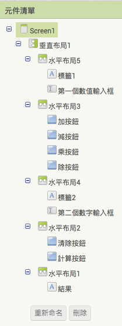

# 練習題：計算機

**學習重點**

* 變數
* 流程控制
* 函式
* 算數運算

**流程**

* 畫面製作
* 實作程式邏輯

## 畫面製作

### 步驟ㄧ：基本佈局

1. 新增一個垂直佈局
1. 裡面加五個水平佈局
1. 修改 screen 元件屬性標題

### 步驟二：第一個數值

1. 新增標籤和文字方塊
1. 修改標籤文字
1. 修改文字方塊元件命名
1. 垂直置中

### 步驟三：製作加減乘除按鈕

1. 新增 4 個按鈕
1. 修改元件命名文字
1. 修改元件屬性文字

### 步驟四：第二個數值

* 重複前一個步驟

### 步驟五：製作清除與計算按鈕

1. 新增 2 個按鈕
1. 修改元件命名文字
1. 修改元件屬性文字
1. 設定按鈕高度自動填滿

### 步驟六：製作結果標籤

1. 新增一個標籤
1. 修改元件命名
1. 修改元件屬性文字

## 實作程式邏輯

### 步驟ㄧ：設定初始化變數

1. 設定「第一個數值變數」預設值為零
1. 設定「第二個數值變數」預設值為零
1. 設定「計算結果」變數預設值為零
1. 設定「計算方式」變數預設值為空字串

### 步驟二：實作按鈕事件

1. 新增「加按鈕」事件
1. 設定「結果」的文字為「加按鈕」文字

### 步驟三：實作加減乘除的按鈕事件

1. 設定「計算方式」為「加按鈕」的文字
1. 設定「結果」的文字為「計算方式」變數的值

### 步驟四：定義清除程序

1. 新增「清除」程序
1. 清除變數值
1. 清除輸入框與結果文字
1. 呼叫「清除」程序

### 步驟五：整合清除按鈕

### 步驟六：定義「取得計算結果」程序的基礎版本

1. 新增「取得計算結果」程序
1. 程序將設定「計算結果」變數為 123456789，並回傳變數值。
1. 新增「計算按鈕」事件
1. 設定「結果」的文字為函數回傳值

### 步驟七：為「取得計算結果」程序添加加法邏輯

1. 設定「第一個數值變數」值
1. 設定「第二個數值變數」值
1. 設定「計算結果」值

### 步驟八：為「取得計算結果」程序添加流程控制

1. 添加 if, elseif, else
1. 添加邏輯運算判斷
  1. 如果「計算方式」等於「加」
  1. 如果「計算方式」等於「減」
  1. 如果「計算方式」等於「乘」
  1. 如果「計算方式」等於「除」

### 步驟九：為「取得計算結果」程序添加意外情況

### 步驟十：設定「取得計算結果」程序的算術邏輯

### 成果

