# 練習題：註冊頁

**學習重點**

* 微資料庫 & 網路微資料庫
* 畫面切換
* 通知訊息
* 程序的應用

**流程**

* 畫面製作
* 實作程式邏輯

## 註冊頁畫面製作

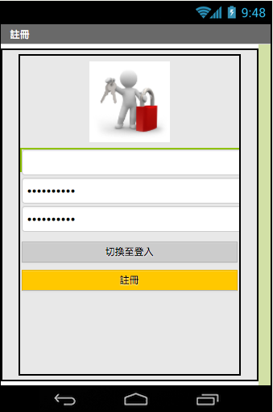

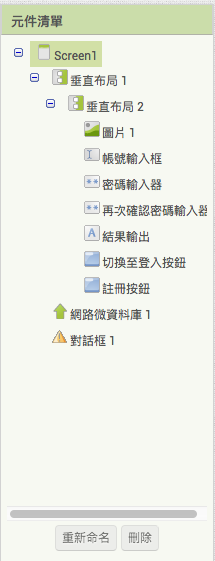

### 步驟ㄧ：基本佈局

1. 新增一個垂直佈局，然後在這個垂直佈局下，在新增一個垂直佈局。
1. 內層的垂直佈局的元件屬性高度為 85 percent，並水平置中。 
1. 修改 screen 元件屬性標題

### 步驟二：插入圖片

### 步驟三：新增一個文字方塊和兩個密碼輸入器

### 步驟四：新增兩個按鈕

## 登入頁畫面製作

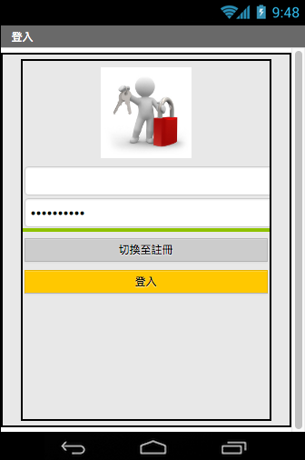

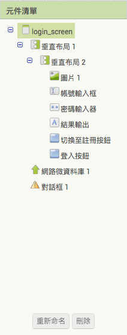

### 步驟ㄧ：基本佈局

1. 新增一個垂直佈局，然後在這個垂直佈局下，在新增一個垂直佈局。
1. 內層的垂直佈局的元件屬性高度為 85 percent，並水平置中。 
1. 修改 screen 元件屬性標題

### 步驟二：插入圖片

### 步驟三：新增一個文字方塊和一個密碼輸入器

### 步驟四：新增兩個按鈕

* 畫面設計的原則
* 配色的原則

## 實作註冊頁程式邏輯

再次確認元件清單中的元件命名跟範例一致

### 步驟ㄧ：實作切換至登入頁

1. 新增「切換至登入按鈕」事件
1. 執行「開啟畫面」，畫面名稱為 login_screen。

### 步驟二：實作註冊按鈕

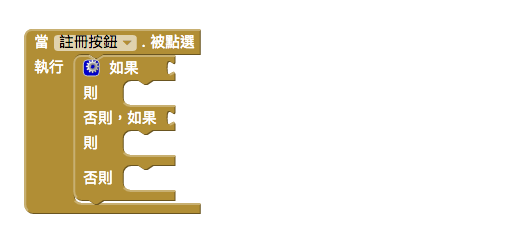

1. 新增「註冊按鈕」事件

### 步驟三：異常註冊邏輯

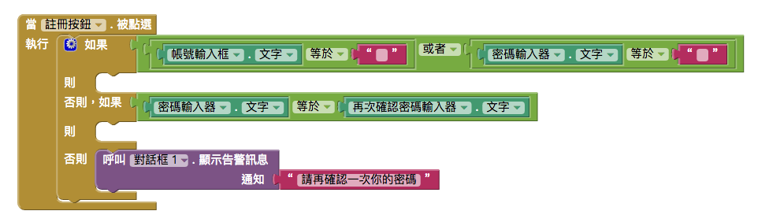

* 帳號跟密碼都不能是空值
* 第一次輸入的密碼跟第二次輸入的密碼要一致

### 步驟四：註冊失敗錯誤訊息

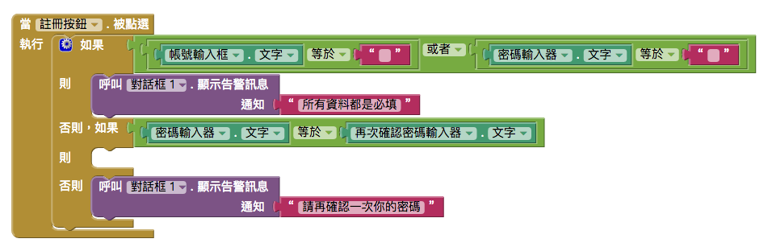

* 若帳號跟密碼其中一個為空值，則跳出警告訊息，內容為「所有資料都是必填」。
* 若第二次輸入的密碼不一致，，則跳出警告訊息，內容為「請再確認一次你的密碼」。

### 步驟五：正常註冊邏輯

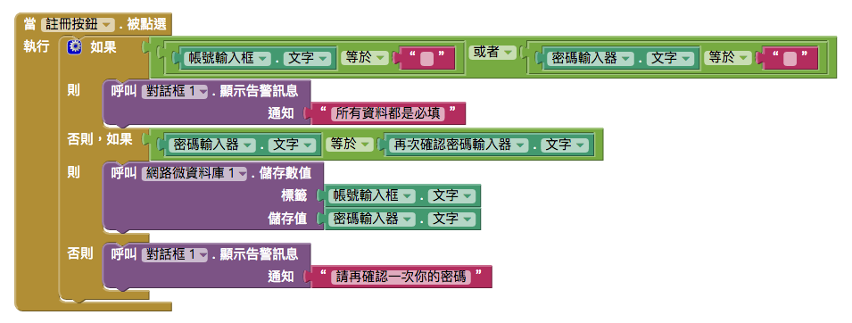

1. 儲存帳號和密碼至「網路微資料庫」

### 步驟六：確認資料有真正儲存到「網路微資料庫」

1. 新增「網路微資料庫」的「數據儲存完畢」事件
2. 事件會將「結果輸出」的文字改為「註冊成功」

### 步驟七：註冊成功後前往登入頁面

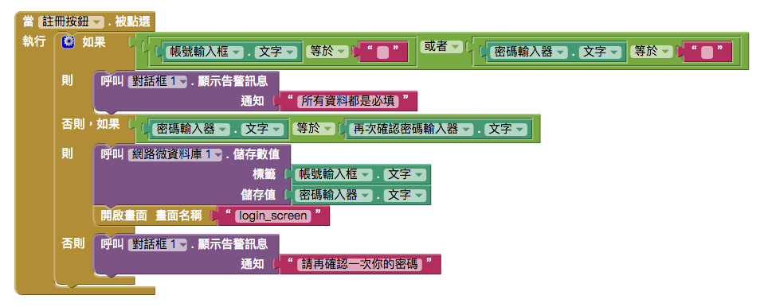

1. 在註冊成功流程中添加「開啟畫面」，畫面的名稱為 login_screen。

### 優化

1. 新增帳號變數和密碼變數，不要一直重複從物件取值。

## 實作登入頁程式邏輯

再次確認元件清單中的元件命名跟範例一致

### 步驟ㄧ：實作切換至註冊頁

1. 新增「切換至註冊按鈕」事件
1. 執行「開啟畫面」，畫面名稱為 Screen1。

### 步驟二：實作登入按鈕

1. 新增「登入按鈕」事件
1. 呼叫「網路微資料庫」取得數值，標籤為「帳號輸入框」的文字。

### 步驟三：登入邏輯判斷

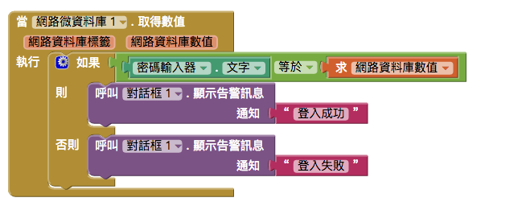

* 密碼需要跟註冊時填入的資料一致，則登入成功。
* 反之，則失敗跳出「登入失敗」警告訊息
  * 需新增使用者介面的「對話框」元件

## 秘密關卡

**學習重點**

* 啟動器

## 實作程式邏輯

### 步驟一：新增 activity 啟動器

1. 新增元件面版的通信連線分類裡的「activity 啟動器」。

### 步驟二：新增觸發事件

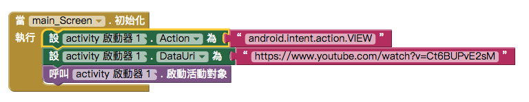

1. 新增畫面初始化事件
1. 設置啟動器的 Action 為 android.intent.action.VIEW
1. 設置啟動器的 DataUrl 為 <https://www.youtube.com/watch?v=Ct6BUPvE2sM>
1. 呼叫啟動器來啟動物件對象。

### 優化

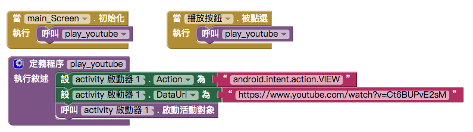

### 成果

**註冊頁**

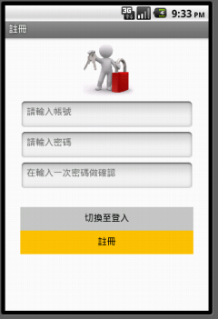

**登入頁**

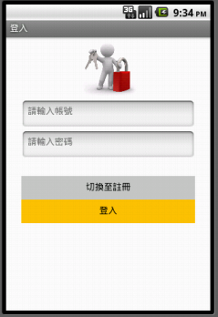